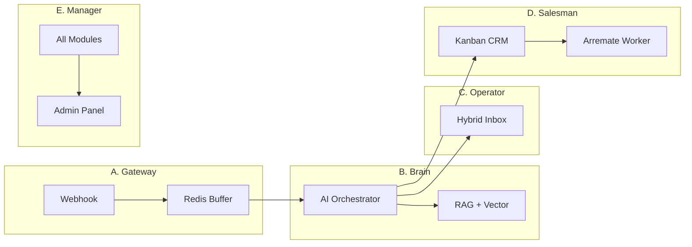
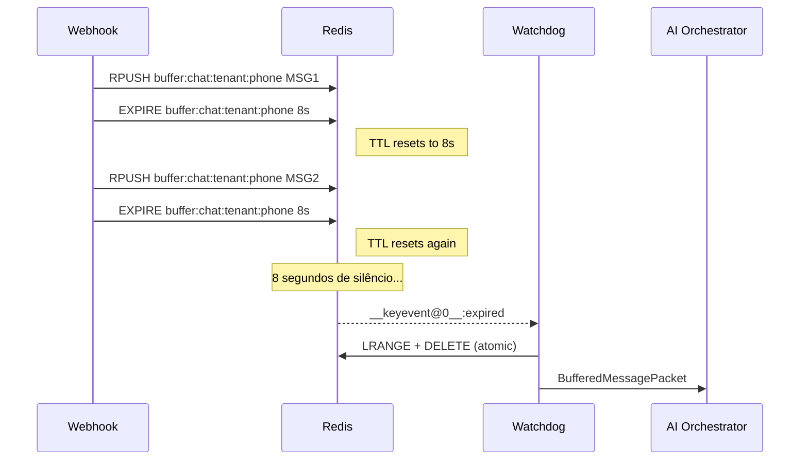
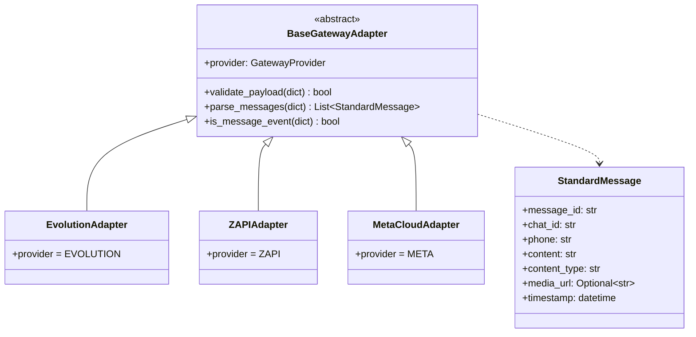
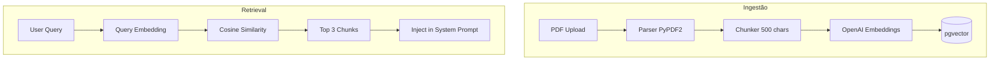
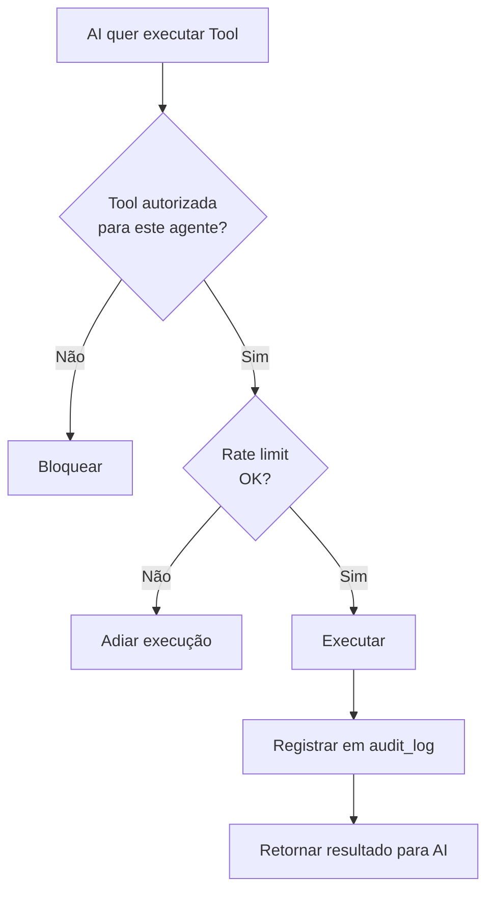
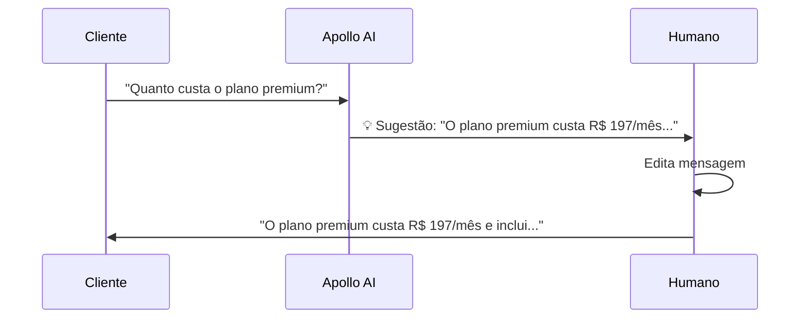
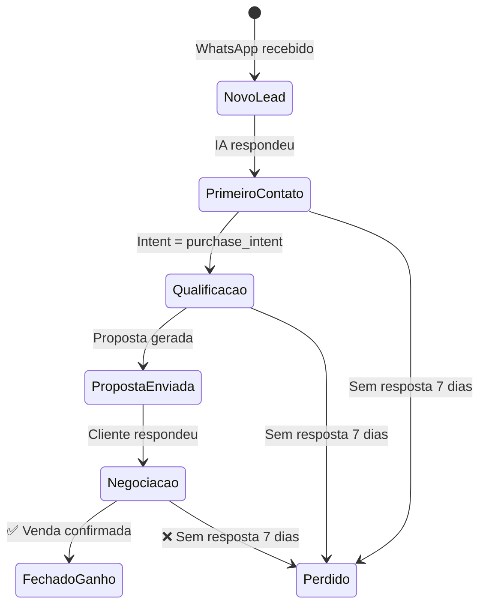
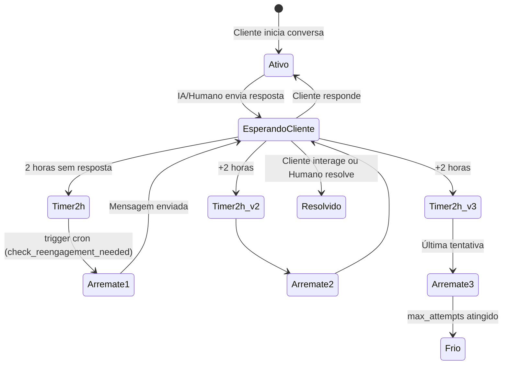

# APOLLO A.I. ADVANCED
## Documento de Arquitetura de Produto v1.0

> **🎯 Missão**: Substituir uma operação fragmentada (n8n + CRMs externos) por uma plataforma SaaS unificada de I.A. que combina mensageria resiliente, inteligência artificial contextual e automação de vendas.

---

## Sumário Executivo



---

# MÓDULO A: "THE GATEWAY" (Mensageria & Estabilidade)

## A.1 O Problema

Usuários de WhatsApp frequentemente "picotam" mensagens:
```
[10:00:01] "Oi"
[10:00:03] "Preciso de ajuda"
[10:00:05] [Áudio 30s]
[10:00:08] "É urgente"
```

Bots ingênuos respondem a cada mensagem individualmente, criando experiência caótica.

---

## A.2 Design do Buffer Inteligente (Anti-Picote)

### Arquitetura Redis



### Estrutura de Chaves Redis

| Chave | Formato | TTL | Propósito |
|-------|---------|-----|-----------|
| `buffer:chat:{tenant_id}:{chat_id}` | List (JSON items) | 8s | Acumula mensagens |
| `lock:buffer:{tenant_id}:{chat_id}` | String "1" | 5s | Impede duplo processamento |

### Código de Referência

```python
# backend/app/services/message_buffer.py

BUFFER_TTL_SECONDS = 8  # Silêncio necessário antes de processar

async def push_message(self, tenant_id: str, message: StandardMessage) -> int:
    key = f"buffer:chat:{tenant_id}:{message.chat_id}"
    
    # Adiciona ao buffer
    await self.redis.rpush(key, json.dumps(message_data))
    
    # Reset TTL - cerne do anti-picote
    await self.redis.expire(key, BUFFER_TTL_SECONDS)
    
    return await self.redis.llen(key)
```

### Watchdog (Detecção de Expiração)

O sistema usa **Redis Keyspace Notifications** para detectar buffers expirados:

```python
# Requer: redis-cli config set notify-keyspace-events Ex

async def _watch_loop(self):
    pubsub = redis.pubsub()
    await pubsub.psubscribe("__keyevent@0__:expired")
    
    async for message in pubsub.listen():
        key = message.get("data", b"").decode()
        if key.startswith("buffer:chat:"):
            # Extrair tenant_id, chat_id e processar
            packet = await self.get_buffer(tenant_id, chat_id)
            await self._notify_handlers(packet)
```

---

## A.3 Design do Adapter Universal

### Problema

Cada gateway WhatsApp envia JSONs completamente diferentes:

| Gateway | Estrutura | Campo de Telefone |
|---------|-----------|-------------------|
| Evolution API | `{event, instance, data: {key: ...}}` | `data.key.remoteJid` |
| Z-API | `{phone, messageId, text: {...}}` | `phone` |
| Meta Cloud | `{object, entry: [{changes: [...]}]}` | `contacts[0].wa_id` |

### Solução: Adapter Pattern



### Formato Normalizado (StandardMessage)

```python
class StandardMessage(BaseModel):
    message_id: str              # ID único do gateway
    chat_id: str                 # ID da conversa (geralmente = phone)
    phone: str                   # Telefone E.164 (+5511999999999)
    content: str                 # Texto ou transcrição
    content_type: Literal["text", "audio", "image", "video", "document"]
    media_url: Optional[str]     # URL para mídia
    media_mime_type: Optional[str]
    media_duration_seconds: Optional[int]  # Duração de áudio
    is_from_me: bool             # False = cliente, True = nosso bot
    timestamp: datetime
```

### GatewayAdapterFactory

```python
class GatewayAdapterFactory:
    _adapters = [EvolutionAdapter(), ZAPIAdapter(), MetaCloudAdapter()]
    
    @classmethod
    def detect_and_get_adapter(cls, payload: dict) -> Optional[BaseGatewayAdapter]:
        """Auto-detecta provider pela estrutura do payload"""
        for adapter in cls._adapters:
            if adapter.validate_payload(payload):
                return adapter
        return None
    
    @classmethod
    def parse_webhook(cls, payload: dict, provider: str = None) -> List[StandardMessage]:
        adapter = cls.get_adapter(provider) if provider else cls.detect_and_get_adapter(payload)
        if not adapter or not adapter.is_message_event(payload):
            return []
        return adapter.parse_messages(payload)
```

---

## A.4 Fila de Prioridade

### Regra de Negócio

| Tipo de Mensagem | Prioridade | Justificativa |
|------------------|------------|---------------|
| **Ao Vivo** (tempo real) | 🔴 ALTA | Cliente esperando resposta agora |
| **Arremate** (follow-up) | 🟡 MÉDIA | Re-engajamento pode esperar alguns minutos |
| **Bulk/Campanhas** | 🟢 BAIXA | Mensagens em massa não são urgentes |

### Implementação Sugerida

O sistema atual processa em ordem de chegada. Para priorização futura:

```python
# Estrutura de filas separadas
QUEUE_HIGH = "queue:ai:high"      # Mensagens ao vivo
QUEUE_MEDIUM = "queue:ai:medium"  # Arremates
QUEUE_LOW = "queue:ai:low"        # Campanhas

# Worker consome na ordem: HIGH -> MEDIUM -> LOW
```

---

# MÓDULO B: "THE BRAIN" (Motor de I.A. & Orquestração)

## B.1 Context Window Management

### Problema

Conversas longas estouram limite de tokens (GPT-4o: 128k, mas cara; GPT-4o-mini: 128k mais acessível).

### Estratégia de Windowing

```python
class ConversationContext:
    def __init__(self, ...):
        self.history = []  # Histórico completo
    
    def get_formatted_history(self, window: int = 10) -> List[Dict]:
        """Retorna apenas as últimas N mensagens"""
        return self.history[-window:]

# Configurável por agente:
agent.memory_window = 10  # Default: 10 últimas mensagens
```

### Sumarização Futura (Roadmap)

Para conversas muito longas, implementar sumarização automática:

```python
# TODO: Implementar em Fase 3
async def summarize_history(self, messages: List[Dict]) -> str:
    """Resume história antiga mantendo contexto essencial"""
    if len(messages) <= self.memory_window:
        return None
    
    old_messages = messages[:-self.memory_window]
    summary = await self.openai.chat.completions.create(
        model="gpt-4o-mini",
        messages=[
            {"role": "system", "content": "Resuma a conversa mantendo: nome do cliente, interesse principal, dúvidas levantadas."},
            {"role": "user", "content": json.dumps(old_messages)}
        ],
        max_tokens=300
    )
    return summary.choices[0].message.content
```

---

## B.2 RAG Pipeline (Retrieval-Augmented Generation)

### Arquitetura



### Tabelas Envolvidas

```sql
-- Metadados do documento
CREATE TABLE knowledge_base (
    id UUID PRIMARY KEY,
    tenant_id UUID NOT NULL,
    agent_id UUID,
    title VARCHAR(255),
    source_type VARCHAR(50),  -- 'pdf', 'url', 'manual'
    status VARCHAR(50),       -- 'processing', 'completed', 'failed'
    chunk_count INTEGER
);

-- Chunks vetorizados
CREATE TABLE knowledge_chunks (
    id UUID PRIMARY KEY,
    knowledge_base_id UUID REFERENCES knowledge_base(id),
    tenant_id UUID NOT NULL,
    content TEXT,
    chunk_index INTEGER,
    embedding vector(1536),   -- OpenAI text-embedding-3-small
    metadata JSONB
);

-- Índice IVFFlat para busca rápida
CREATE INDEX idx_knowledge_chunks_embedding 
    ON knowledge_chunks USING ivfflat (embedding vector_cosine_ops) 
    WITH (lists = 100);
```

### Função de Busca (Hybrid: Vector + Tenant Filter)

```sql
CREATE FUNCTION match_knowledge_chunks(
    p_query_embedding vector(1536),
    p_tenant_id UUID,
    p_agent_id UUID DEFAULT NULL,
    p_match_threshold FLOAT DEFAULT 0.7,
    p_match_count INT DEFAULT 5
) RETURNS TABLE (
    id UUID,
    content TEXT,
    similarity FLOAT
) AS $$
BEGIN
    RETURN QUERY
    SELECT 
        kc.id,
        kc.content,
        1 - (kc.embedding <=> p_query_embedding) AS similarity
    FROM knowledge_chunks kc
    JOIN knowledge_base kb ON kb.id = kc.knowledge_base_id
    WHERE kc.tenant_id = p_tenant_id
        AND kb.status = 'completed'
        AND (p_agent_id IS NULL OR kb.agent_id = p_agent_id)
        AND 1 - (kc.embedding <=> p_query_embedding) >= p_match_threshold
    ORDER BY kc.embedding <=> p_query_embedding
    LIMIT p_match_count;
END;
$$ LANGUAGE plpgsql;
```

### Chunking Strategy

```python
# backend/app/services/rag.py

CHUNK_SIZE = 500        # ~500 caracteres por chunk
CHUNK_OVERLAP = 50      # 50 chars de overlap para continuidade

def chunk_text(self, text: str) -> List[str]:
    """Split text into overlapping chunks"""
    chunks = []
    start = 0
    while start < len(text):
        end = min(start + CHUNK_SIZE, len(text))
        # Tenta quebrar em parágrafo ou sentença
        if end < len(text):
            last_break = text.rfind('\n', start, end)
            if last_break == -1:
                last_break = text.rfind('. ', start, end)
            if last_break > start:
                end = last_break + 1
        
        chunks.append(text[start:end].strip())
        start = end - CHUNK_OVERLAP
    
    return [c for c in chunks if c]
```

---

## B.3 Router Semântico (Intent Detection)

### Categorias de Intenção

```python
class MessageIntent(str, Enum):
    GREETING = "greeting"           # Saudação
    QUESTION = "question"           # Pergunta geral
    PURCHASE_INTENT = "purchase_intent"  # Quer comprar
    SUPPORT = "support"             # Precisa de ajuda técnica
    COMPLAINT = "complaint"         # Reclamação
    SCHEDULING = "scheduling"       # Agendamento
    FAREWELL = "farewell"           # Despedida
    UNKNOWN = "unknown"             # Não classificável
```

### Detecção via LLM

```python
async def _detect_intent(self, message: str) -> MessageIntent:
    response = await self.openai.chat.completions.create(
        model="gpt-4o-mini",  # Modelo leve para classificação
        messages=[
            {
                "role": "system",
                "content": """Classifique a intenção da mensagem em uma das categorias:
                - greeting: Saudação ou início de conversa
                - question: Pergunta sobre produtos/serviços
                - purchase_intent: Interesse em comprar
                - support: Solicitação de suporte
                - complaint: Reclamação ou insatisfação
                - scheduling: Agendamento ou horários
                - farewell: Despedida ou encerramento
                - unknown: Não se encaixa em nenhuma
                
                Responda APENAS com a categoria."""
            },
            {"role": "user", "content": message}
        ],
        max_tokens=20,
        temperature=0
    )
    
    intent_str = response.choices[0].message.content.strip().lower()
    try:
        return MessageIntent(intent_str)
    except ValueError:
        return MessageIntent.UNKNOWN
```

### Uso Futuro (Roadmap)

```python
# Diferentes comportamentos por intenção
if intent == MessageIntent.COMPLAINT:
    # Aumentar prioridade + notificar humano
    await notify_human_agent(conversation_id, "Reclamação detectada")

elif intent == MessageIntent.PURCHASE_INTENT:
    # Ativar ferramentas de agendamento/proposta
    await enable_sales_tools(conversation_id)
```

---

## B.4 Action Engine (Tools)

### Protocolo de Segurança



### Tabela de Configuração (Implementada)

```sql
CREATE TABLE tools_config (
    id UUID PRIMARY KEY,
    tenant_id UUID NOT NULL,
    agent_id UUID,              -- NULL = disponível para todos os agentes
    name VARCHAR(100) NOT NULL,
    description TEXT,
    tool_type VARCHAR(50),      -- 'webhook', 'api', 'database', 'builtin'
    config JSONB NOT NULL,      -- URL, headers, etc.
    trigger_conditions JSONB,   -- Quando ativar automaticamente
    input_schema JSONB,         -- JSON Schema para validar parâmetros
    output_mapping JSONB,       -- Como extrair dados da resposta
    auth_type VARCHAR(50),      -- 'none', 'api_key', 'oauth2'
    auth_config JSONB,          -- Credenciais (criptografadas)
    is_active BOOLEAN DEFAULT true,
    total_calls INTEGER DEFAULT 0,
    successful_calls INTEGER DEFAULT 0,
    avg_latency_ms INTEGER
);
```

### Exemplo: Tool de Agendamento

```json
{
  "name": "check_availability",
  "description": "Consulta disponibilidade de horários na agenda",
  "tool_type": "webhook",
  "config": {
    "method": "GET",
    "url": "https://api.calendly.com/event_types/{agent_id}/available_times",
    "timeout_ms": 5000
  },
  "input_schema": {
    "type": "object",
    "properties": {
      "date": {"type": "string", "format": "date"}
    },
    "required": ["date"]
  },
  "output_mapping": {
    "available_slots": "$.data[*].start_time"
  }
}
```

---

# MÓDULO C: "THE OPERATOR" (Interface Híbrida & Inbox)

## C.1 Modo Espião (Live View)

### Requisito UX

O humano vê a IA "digitando" em tempo real antes de enviar.

### Implementação (WebSocket)

```typescript
// frontend/src/hooks/useConversationRealtime.ts

const channel = supabase.channel(`chat:${conversationId}`)
  .on('broadcast', { event: 'ai_typing' }, (payload) => {
    setAiDraft(payload.partial_response);
  })
  .on('broadcast', { event: 'ai_sent' }, (payload) => {
    setMessages(prev => [...prev, payload.message]);
    setAiDraft(null);
  })
  .subscribe();
```

### Backend (Streaming)

```python
async def generate_response_streaming(self, ...):
    """Gera resposta com streaming para Live View"""
    async for chunk in await self.openai.chat.completions.create(
        model=agent.model_name,
        messages=messages,
        stream=True
    ):
        partial = chunk.choices[0].delta.content
        if partial:
            # Broadcast para frontend
            await supabase.channel(f"chat:{conversation_id}").send(
                event="ai_typing",
                payload={"partial_response": partial}
            )
```

---

## C.2 Modo Sussurro (Copilot)

### Fluxo UX



### Interface

```typescript
// Componente: CopilotSuggestion.tsx

interface SuggestionProps {
  suggestion: string;
  onApprove: (text: string) => void;
  onEdit: (text: string) => void;
  onReject: () => void;
}

function CopilotSuggestion({ suggestion, onApprove, onEdit, onReject }: SuggestionProps) {
  return (
    <div className="copilot-suggestion">
      <span className="label">💡 Sugestão da IA:</span>
      <textarea value={suggestion} onChange={(e) => onEdit(e.target.value)} />
      <div className="actions">
        <Button onClick={() => onApprove(suggestion)} color="green">Enviar</Button>
        <Button onClick={onReject} color="gray">Descartar</Button>
      </div>
    </div>
  );
}
```

---

## C.3 Botão de Pânico

### Funcionalidade

"Pausar IA por 1h" → Coloca conversa em modo `human` temporariamente.

```typescript
async function pauseAI(conversationId: string, durationMinutes: number = 60) {
  await supabase.from('conversations').update({
    mode: 'human',
    ai_paused_until: new Date(Date.now() + durationMinutes * 60000).toISOString()
  }).eq('id', conversationId);
  
  showNotification("IA pausada por 1 hora nesta conversa");
}
```

---

## C.4 Indicadores Visuais

### Diferenciação de Mensagens

| Tipo | Cor | Badge | Alinhamento |
|------|-----|-------|-------------|
| Cliente | Cinza escuro | 👤 | Esquerda |
| IA | Azul degradê | 🤖 + nome do agente | Direita |
| Humano | Verde | 👨‍💼 + nome do atendente | Direita |
| Sistema | Amarelo (pill central) | ⚙️ | Centro |

```css
.message--customer { background: var(--gray-800); }
.message--ai { background: linear-gradient(90deg, var(--blue-600), var(--indigo-600)); }
.message--human { background: var(--green-600); border-left: 3px solid var(--green-400); }
.message--system { background: var(--yellow-100); color: var(--yellow-800); }
```

---

# MÓDULO D: "THE SALESMAN" (CRM Nativo & Arremate)

## D.1 Kanban Automatizado

### Regras de Movimentação Automática



### Implementação

```python
async def auto_move_lead(conversation_id: str, new_intent: MessageIntent):
    """Move lead no Kanban baseado na intenção detectada"""
    
    if new_intent == MessageIntent.PURCHASE_INTENT:
        target_stage = "Qualificação"
    elif new_intent == MessageIntent.SCHEDULING:
        target_stage = "Proposta Enviada"
    # ...
    
    stage = await supabase.table("crm_pipeline_stages").select("id").eq(
        "name", target_stage
    ).eq("tenant_id", tenant_id).single().execute()
    
    if stage.data:
        await supabase.table("crm_leads").update({
            "pipeline_stage_id": stage.data["id"]
        }).eq("id", lead_id).execute()
```

---

## D.2 Máquina de Estados: Arremate (Re-engagement)

### Diagrama de Estados



### Configuração por Agente

```sql
-- Tabela: agents

reengagement_enabled BOOLEAN DEFAULT false,
reengagement_delay_minutes INTEGER DEFAULT 120,   -- 2 horas
reengagement_max_attempts INTEGER DEFAULT 3,
reengagement_prompts JSONB DEFAULT '[
    "Olá! Notei que ficou um pouco quieto por aqui. Posso ajudar em algo mais?",
    "Ei! Ainda está por aí? Lembrei de você e queria saber se posso ajudar.",
    "Oi! Só passando para verificar se você ainda precisa de alguma informação."
]',
business_hours JSONB DEFAULT '{"enabled": false, "start": 9, "end": 21}'
```

### Cron Job (Executar a cada 5 min)

```sql
SELECT cron.schedule(
    'reengagement-check',
    '*/5 * * * *',
    'SELECT check_reengagement_needed();'
);
```

### Fluxo de Aprovação (Opcional)

Para operações com supervisão:

```python
# Flag no agente: require_reengagement_approval = true

async def handle_reengagement_event(event: ReengagementEvent):
    agent = await get_agent(event.agent_id)
    
    if agent.require_reengagement_approval:
        # Cria notificação para humano aprovar
        await supabase.table("pending_approvals").insert({
            "type": "reengagement",
            "conversation_id": event.conversation_id,
            "suggested_message": generate_reengagement_message(event),
            "status": "pending"
        }).execute()
    else:
        # Envia automaticamente
        await send_reengagement_message(event)
```

---

## D.3 Lead Scoring

### Modelo de Pontuação

| Fator | Pontos | Justificativa |
|-------|--------|---------------|
| Intent = purchase_intent | +30 | Interesse explícito |
| Respondeu em < 5 min | +10 | Engajamento alto |
| Enviou áudio/imagem | +5 | Investimento na conversa |
| Perguntou sobre preço | +20 | Considerando compra |
| Intent = complaint | -20 | Risco de churn |
| 3+ mensagens sem resposta | -15 | Desengajando |

### Classificação

```python
def classify_temperature(score: int) -> str:
    if score >= 50:
        return "hot"    # 🔥 Quente - Prioridade máxima
    elif score >= 20:
        return "warm"   # 🌡️ Morno - Atenção
    else:
        return "cold"   # ❄️ Frio - Arremate ou descarte
```

---

# MÓDULO E: "THE MANAGER" (Admin & Multi-Tenancy)

## E.1 Isolamento de Dados (Row Level Security)

### Funções Auxiliares

```sql
-- Retorna tenant_id do usuário logado
CREATE FUNCTION get_user_tenant_id() RETURNS UUID AS $$
    SELECT tenant_id FROM public.profiles 
    WHERE id = auth.uid()
$$ LANGUAGE sql SECURITY DEFINER STABLE;

-- Verifica se é Super Admin
CREATE FUNCTION is_super_admin() RETURNS BOOLEAN AS $$
    SELECT EXISTS (
        SELECT 1 FROM public.profiles 
        WHERE id = auth.uid() AND role = 'super_admin'
    )
$$ LANGUAGE sql SECURITY DEFINER STABLE;
```

### Políticas RLS Padrão

```sql
-- Padrão para todas as tabelas
CREATE POLICY "tenant_isolation" ON public.{table}
    FOR ALL USING (tenant_id = get_user_tenant_id());

-- Bypass para Super Admin
CREATE POLICY "super_admin_bypass" ON public.{table}
    FOR ALL USING (is_super_admin());
```

### Tabelas com RLS Ativado

- ✅ `tenants`
- ✅ `profiles`
- ✅ `agents`
- ✅ `conversations`
- ✅ `messages`
- ✅ `crm_leads`
- ✅ `crm_pipeline_stages`
- ✅ `knowledge_base`
- ✅ `knowledge_chunks`
- ✅ `tools_config`
- ✅ `token_usage`
- ✅ `reengagement_events`

---

## E.2 Gestão de Custos (Token Tracking)

### Tabela de Uso

```sql
CREATE TABLE token_usage (
    id UUID PRIMARY KEY,
    tenant_id UUID NOT NULL,
    agent_id UUID,
    period_start DATE NOT NULL,
    period_end DATE NOT NULL,
    tokens_input INTEGER DEFAULT 0,
    tokens_output INTEGER DEFAULT 0,
    total_tokens INTEGER DEFAULT 0,
    estimated_cost_usd DECIMAL(10,4) DEFAULT 0,
    total_requests INTEGER DEFAULT 0,
    CONSTRAINT unique_token_usage_period UNIQUE (tenant_id, period_start)
);
```

### Registro por Mensagem

```python
async def _save_messages(self, ...):
    # Após gerar resposta AI
    supabase.table("messages").insert({
        "conversation_id": conversation_id,
        "sender_type": "ai",
        "content": ai_response,
        "ai_model": agent.model_name,
        "ai_tokens_input": usage.prompt_tokens,
        "ai_tokens_output": usage.completion_tokens,
        "ai_latency_ms": response_time_ms,
    }).execute()
```

### Agregação Mensal (Cron)

```sql
SELECT cron.schedule(
    'aggregate-tokens',
    '0 7 * * *',  -- Diariamente às 4h BR
    'SELECT aggregate_monthly_tokens();'
);
```

### Cálculo de Custo

```python
# Preços OpenAI (exemplo)
PRICING = {
    "gpt-4o": {"input": 5.00/1_000_000, "output": 15.00/1_000_000},
    "gpt-4o-mini": {"input": 0.15/1_000_000, "output": 0.60/1_000_000},
}

def calculate_cost(model: str, tokens_in: int, tokens_out: int) -> float:
    prices = PRICING.get(model, PRICING["gpt-4o-mini"])
    return tokens_in * prices["input"] + tokens_out * prices["output"]
```

---

## E.3 Debug Log (Chain of Thought)

### Estrutura de Log

```json
{
  "conversation_id": "uuid",
  "message_id": "uuid",
  "timestamp": "2026-01-06T00:00:00Z",
  "stages": [
    {
      "stage": "buffer_received",
      "duration_ms": 12,
      "data": {"message_count": 3}
    },
    {
      "stage": "intent_detection",
      "duration_ms": 230,
      "data": {"intent": "purchase_intent", "confidence": 0.92}
    },
    {
      "stage": "rag_retrieval",
      "duration_ms": 85,
      "data": {"chunks_found": 3, "top_similarity": 0.87}
    },
    {
      "stage": "llm_generation",
      "duration_ms": 1420,
      "data": {
        "model": "gpt-4o-mini",
        "tokens_in": 1250,
        "tokens_out": 180,
        "temperature": 0.7
      }
    },
    {
      "stage": "response_sent",
      "duration_ms": 45,
      "data": {"gateway": "evolution", "status": "delivered"}
    }
  ],
  "total_duration_ms": 1792,
  "error": null
}
```

### Visualização (Admin Panel)

```typescript
// Componente: DebugLogViewer.tsx

function DebugLogViewer({ conversationId }) {
  const { data: logs } = useQuery(['debug-logs', conversationId], fetchLogs);
  
  return (
    <Timeline>
      {logs?.stages.map(stage => (
        <TimelineItem 
          key={stage.stage}
          title={stage.stage}
          duration={`${stage.duration_ms}ms`}
          status={stage.data.error ? 'error' : 'success'}
        >
          <JsonViewer data={stage.data} />
        </TimelineItem>
      ))}
    </Timeline>
  );
}
```

---

# DICIONÁRIO DE DADOS CRÍTICOS

## Tabelas Obrigatórias para MVP

### Core Multi-Tenancy

| Tabela | Propósito | Campos Críticos |
|--------|-----------|-----------------|
| `tenants` | Organizações clientes | `id`, `slug`, `whatsapp_gateway`, `whatsapp_instance_id`, `plan`, `status` |
| `profiles` | Usuários do sistema | `id`, `tenant_id`, `role` (agent/admin/super_admin), `is_available` |

### Messaging Layer

| Tabela | Propósito | Campos Críticos |
|--------|-----------|-----------------|
| `conversations` | Sessões de chat | `id`, `tenant_id`, `agent_id`, `phone_number`, `status`, `mode` (ai/human) |
| `messages` | Histórico de mensagens | `id`, `conversation_id`, `sender_type`, `content`, `ai_tokens_*` |

### AI Configuration

| Tabela | Propósito | Campos Críticos |
|--------|-----------|-----------------|
| `agents` | Configuração de bots | `id`, `tenant_id`, `system_prompt`, `model_name`, `rag_enabled`, `reengagement_*` |
| `knowledge_base` | Documentos RAG | `id`, `tenant_id`, `agent_id`, `status`, `chunk_count` |
| `knowledge_chunks` | Vetores RAG | `id`, `knowledge_base_id`, `content`, `embedding` (vector 1536) |

### CRM Layer

| Tabela | Propósito | Campos Críticos |
|--------|-----------|-----------------|
| `crm_leads` | Contatos/Oportunidades | `id`, `tenant_id`, `pipeline_stage_id`, `whatsapp`, `temperature`, `score` |
| `crm_pipeline_stages` | Fases do Kanban | `id`, `tenant_id`, `name`, `position`, `is_won_stage`, `is_lost_stage` |

### Operations

| Tabela | Propósito | Campos Críticos |
|--------|-----------|-----------------|
| `reengagement_events` | Fila de arremates | `id`, `conversation_id`, `attempt_number`, `processed` |
| `token_usage` | Consumo para billing | `id`, `tenant_id`, `period_*`, `total_tokens`, `estimated_cost_usd` |
| `tools_config` | Ferramentas da IA | `id`, `tenant_id`, `agent_id`, `tool_type`, `config` |

---

# FLUXOGRAMA LÓGICO: JORNADA DA MENSAGEM

```
┌─────────────────────────────────────────────────────────────────────────────┐
│                           ENTRADA: WEBHOOK                                  │
│  POST /api/v1/webhooks/{gateway}                                           │
│  Payload: JSON (Evolution/Z-API/Meta)                                       │
└─────────────────────────────────────────────────────────────────────────────┘
                                      │
                                      ▼
┌─────────────────────────────────────────────────────────────────────────────┐
│  1. GATEWAY ADAPTER FACTORY                                                 │
│     - Auto-detecta provider pela estrutura                                  │
│     - Valida se é evento de mensagem (não status update)                   │
│     - Converte para StandardMessage                                         │
│     - Filtra mensagens "from_me" (nossas próprias)                         │
└─────────────────────────────────────────────────────────────────────────────┘
                                      │
                          StandardMessage(phone, content, ...)
                                      │
                                      ▼
┌─────────────────────────────────────────────────────────────────────────────┐
│  2. TENANT RESOLVER                                                         │
│     - Identifica tenant pelo whatsapp_instance_id do gateway               │
│     - Valida status do tenant (active)                                      │
│     - Carrega configurações do tenant                                       │
│     ⚠️ SE tenant inválido/suspenso → DROP mensagem + log                   │
└─────────────────────────────────────────────────────────────────────────────┘
                                      │
                                      ▼
┌─────────────────────────────────────────────────────────────────────────────┐
│  3. MESSAGE BUFFER (Redis)                                                  │
│     - RPUSH buffer:chat:{tenant}:{phone} {message_json}                    │
│     - EXPIRE buffer:chat:{tenant}:{phone} 8s                               │
│     - Cada nova mensagem RESETA o TTL                                       │
│     → RETORNO IMEDIATO (202 Accepted)                                       │
└─────────────────────────────────────────────────────────────────────────────┘
                                      │
                        [8 segundos de silêncio...]
                                      │
                                      ▼
┌─────────────────────────────────────────────────────────────────────────────┐
│  4. BUFFER WATCHDOG                                                         │
│     - Subscrito em __keyevent@0__:expired                                  │
│     - Detecta expiração do buffer                                           │
│     - Adquire lock (SET lock:buffer:... NX EX 5)                           │
│     - LRANGE + DELETE atomicamente                                          │
│     - Monta BufferedMessagePacket                                           │
└─────────────────────────────────────────────────────────────────────────────┘
                                      │
                  BufferedMessagePacket(messages[], phone, tenant_id)
                                      │
                                      ▼
┌─────────────────────────────────────────────────────────────────────────────┐
│  5. AI ORCHESTRATOR                                                         │
│                                                                              │
│  5a. Conversa: get_or_create_conversation(phone)                           │
│      - Busca conversa ativa existente                                       │
│      - Se não existir, cria nova + cria Lead no CRM                        │
│                                                                              │
│  5b. Verificação de Modo:                                                    │
│      ⚠️ SE mode != 'ai' → SKIP (humano assumiu)                            │
│                                                                              │
│  5c. Carrega AgentConfig (system_prompt, model, etc)                       │
│                                                                              │
│  5d. Carrega Context (últimas N mensagens)                                 │
│                                                                              │
│  5e. Combina mensagens do packet em uma só                                 │
└─────────────────────────────────────────────────────────────────────────────┘
                                      │
                                      ▼
┌─────────────────────────────────────────────────────────────────────────────┐
│  6. INTENT DETECTION (se habilitado)                                        │
│     - Chamada rápida ao GPT-4o-mini                                         │
│     - Classifica: greeting/question/purchase_intent/support/etc            │
│     - Usado para: routing, scoring, analytics                              │
└─────────────────────────────────────────────────────────────────────────────┘
                                      │
                                      ▼
┌─────────────────────────────────────────────────────────────────────────────┐
│  7. RAG RETRIEVAL (se habilitado)                                           │
│     - Gera embedding da query do usuário                                    │
│     - Busca chunks similares: match_knowledge_chunks()                     │
│     - Filtra por tenant_id + threshold (0.7)                               │
│     - Injeta top 3-5 chunks no system prompt                               │
└─────────────────────────────────────────────────────────────────────────────┘
                                      │
                                      ▼
┌─────────────────────────────────────────────────────────────────────────────┐
│  8. LLM GENERATION                                                          │
│     - Monta prompt: system + history + RAG context + user message          │
│     - Chama OpenAI API (gpt-4o ou gpt-4o-mini)                             │
│     - Registra tokens consumidos                                            │
│     ⚠️ SE falhar → usa fallback_message                                    │
└─────────────────────────────────────────────────────────────────────────────┘
                                      │
                                      ▼
┌─────────────────────────────────────────────────────────────────────────────┐
│  9. PERSISTENCE                                                              │
│     - INSERT messages (user + ai)                                           │
│     - UPDATE conversation (last_message_at, counters)                       │
│     - UPDATE lead (last_contact_at)                                         │
│     - UPDATE token_usage (incrementa consumo)                               │
└─────────────────────────────────────────────────────────────────────────────┘
                                      │
                                      ▼
┌─────────────────────────────────────────────────────────────────────────────┐
│  10. WHATSAPP SENDER                                                         │
│      - WhatsAppSenderService.send_text(tenant, phone, response)            │
│      - Detecta gateway configurado (Evolution/Z-API/Meta)                  │
│      - Formata requisição para o gateway específico                        │
│      - Envia via HTTP                                                        │
│      - Registra status de entrega                                           │
└─────────────────────────────────────────────────────────────────────────────┘
```

---

# STACK DE WORKERS

## Event-Driven (Redis Pub/Sub)

| Worker | Trigger | Responsabilidade |
|--------|---------|------------------|
| BufferWatchdog | `__keyevent@0__:expired` | Detectar buffers expirados → processar pacote |
| RealtimeBroadcast | Supabase Realtime | Notificar frontend de novas mensagens |

## Time-Based (pg_cron)

| Job | Schedule | Responsabilidade |
|-----|----------|------------------|
| `reengagement-check` | `*/5 * * * *` | Verificar conversas inativas → criar eventos de arremate |
| `update-agent-stats` | `0 6 * * *` | Atualizar contadores de conversas/mensagens por agente |
| `aggregate-tokens` | `0 7 * * *` | Consolidar uso de tokens mensal para billing |
| `cleanup-old-data` | `0 8 * * 0` | Limpar eventos processados (7d) e mensagens deletadas (30d) |

## Application-Level (Python asyncio)

| Worker | Inicialização | Responsabilidade |
|--------|---------------|------------------|
| BufferWatchdog | `lifespan.startup` | Subscrição Redis keyspace |
| ReengagementWatchdog | `lifespan.startup` | Polling periódico (backup do cron) |

---

# CHECKLIST DE VALIDAÇÃO - FASE 1

## ✅ Infraestrutura Base

- [ ] Docker Compose funcional com: FastAPI, Redis, PostgreSQL (Supabase local ou cloud)
- [ ] Migrations 001-004 aplicadas sem erros
- [ ] RLS policies ativas em todas as tabelas
- [ ] Redis keyspace notifications habilitadas (`notify-keyspace-events Ex`)

## ✅ Gateway de Mensagens

- [ ] Endpoint POST `/api/v1/webhooks/evolution` respondendo 202
- [ ] Endpoint POST `/api/v1/webhooks/zapi` respondendo 202
- [ ] GatewayAdapterFactory parseando corretamente ambos formatos
- [ ] StandardMessage sendo gerada com todos os campos

## ✅ Buffer Anti-Picote

- [ ] Mensagens sendo armazenadas em Redis (`buffer:chat:*`)
- [ ] TTL resetando a cada nova mensagem
- [ ] BufferWatchdog detectando expiração
- [ ] Lock distribuído evitando duplo processamento
- [ ] BufferedMessagePacket sendo gerado corretamente

## ✅ Persistência

- [ ] Tenant sendo identificado pelo instance_id
- [ ] Conversações sendo criadas/recuperadas
- [ ] Leads sendo criados automaticamente
- [ ] Mensagens (user + ai) sendo salvas
- [ ] Contadores sendo atualizados

## ✅ Testes de Resiliência

- [ ] Webhook com payload inválido → 400 (não 500)
- [ ] Tenant não encontrado → 404 com log
- [ ] Redis indisponível → fallback ou retry com backoff
- [ ] OpenAI timeout → fallback_message usado
- [ ] Rate limit OpenAI → retry com exponential backoff

## ✅ Observabilidade

- [ ] Logs estruturados (structlog) em JSON
- [ ] Métricas de latência por stage
- [ ] Contagem de erros por tipo
- [ ] Health check endpoint `/health`

---

# ROADMAP DE FASES

## Fase 1: A Fundação de Ferro ✅ (Atual)

> **Meta**: O sistema recebe mensagem do WhatsApp e salva no banco sem perder nada, mesmo com carga alta.

**Entregáveis**:
- ✅ Banco de dados (Supabase) com schema completo
- ✅ Auth (JWT + Supabase Auth)
- ✅ Gateway de Mensagens (Evolution + Z-API adapters)
- ✅ Buffer Anti-Picote (Redis)
- ✅ Filas e Workers (BufferWatchdog)

---

## Fase 2: O Cérebro Básico (Chat & RAG)

> **Meta**: A IA responde perguntas baseadas no PDF do cliente sem alucinar.

**Entregáveis**:
- [ ] Integração OpenAI (gpt-4o-mini)
- [ ] Context Window Management
- [ ] Intent Detection
- [ ] Pipeline de Ingestão PDF
- [ ] RAG com pgvector
- [ ] WhatsApp Sender (responder mensagens)

---

## Fase 3: O Operador (Inbox Frontend)

> **Meta**: O cliente consegue ver a conversa e intervir se necessário.

**Entregáveis**:
- [ ] Layout Admin (Mantine v7)
- [ ] Lista de Conversas (filtros, busca)
- [ ] Chat View com real-time (WebSockets)
- [ ] Modo Espião (ver IA digitando)
- [ ] Modo Sussurro (aprovar sugestões)
- [ ] Botão de Pânico

---

## Fase 4: A Máquina de Vendas (CRM & Arremate)

> **Meta**: O sistema começa a vender ativamente e recuperar leads perdidos.

**Entregáveis**:
- [ ] Kanban Board (@hello-pangea/dnd)
- [ ] Lead Scoring automático
- [ ] Workers de Arremate (pg_cron)
- [ ] Configuração de re-engajamento por agente
- [ ] Tools de Agendamento integradas
- [ ] Analytics de conversão

---

> **⚠️ AVISO FINAL**: Este documento é a fonte de verdade para os Agentes Desenvolvedores. Qualquer mudança arquitetural significativa deve ser refletida aqui primeiro.
